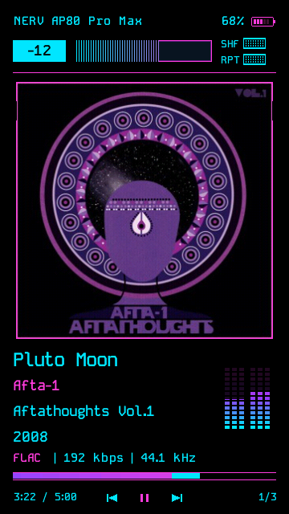
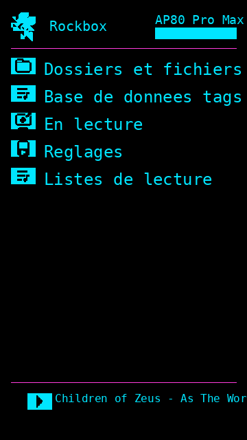

# NERV — adapted for the Hidizs AP80 Pro Max (360 × 640)

Portrait adaptation of the **NERV** Rockbox theme by EppsNL
([Innioasis-y1-rockbox-themes](https://github.com/EppsNL/Innioasis-y1-rockbox-themes)).

The original theme was designed for the **landscape 480 × 360** Innioasis Y1.
This modified version relayouts every screen for the **portrait 360 × 640**
display of the **Hidizs AP80 Pro Max**, keeping the same NERV look, but witch cyber-punk-ish
palette, fonts and icons.

| Now playing | Menu / browser |
| ----------- | -------------- |
|  |  |

## What changed

- **WPS (`NERV_AP80.wps`)** — redesigned from horizontal to vertical:
  - Header (NERV label, battery) moved to the top.
  - Volume number + volume bar and SHF/RPT indicators arranged across the top.
  - Album art is now a centered 240 × 240 block.
  - Track title / artist / album / year / file info stacked below the art.
  - Progress bar spans the 320 px content width near the bottom.
  - Play/pause icons + time / playlist position in the footer.
- **SBS (`NERV_AP80.sbs`)** — menu/browser screen relaid out for portrait with a
  320 px UI viewport and footer now-playing strip.
- **Config (`NERV_AP80.cfg`)** — paths updated; font set to the existing
  `35-KodeMonoMPlus2-SemiBold.fnt`; target noted as 360 × 640.
- **Bitmaps resized** to the portrait layout:
  - `AlbumArt.bmp` fallback art: 171 × 171 → 240 × 240
  - `pb_back.bmp` progress-bar track: 420 × 8 → 320 × 8
  - USB screen replaced with a clean "USB CONNECTED" message (the old full-screen
    static-noise `usb_noise.bmp` splash was removed as it filled the whole display)
  - All other monochrome icon/status strips are reused unchanged.

## Cyberpunk colour palette

The theme uses a cyberpunk scheme instead of the original orange/red:

| Element | Colour |
|---|---|
| Foreground (text, mono icons) | cyan `#00E5FF` |
| Glow / accent lines / selection | pink `#FF3CDC` |
| Progress & volume-bar fills | purple→pink / green→cyan gradients |
| NERV logo / album-art fallback | cyan / pink |
| Battery icon | new 5-frame cyan/pink icon matching the theme |

The monochrome status icons (play/pause/shuffle/repeat/etc.) inherit the cyan
foreground automatically; the colour bitmaps (volume bar, progress bar, logos,
battery) were recoloured to match.

## Installing

1. Copy the contents of this folder's `.rockbox/` directory onto the root of
   your player's storage (merge with the existing `.rockbox` folder) so that the
   paths match: `/.rockbox/themes/NERV_AP80.cfg`, `/.rockbox/wps/NERV_AP80.wps`,
   `/.rockbox/wps/NERV_AP80.sbs`, plus the fonts and images.
2. On the player: **Settings → Theme Settings → Browse Theme Files** and pick
   `NERV_AP80.cfg`.
3. If the fonts do not appear, make sure the Rockbox font pack is installed.

## Credits & licence

- Original theme: **NERV** by EppsNL (CC-BY-SA). Based on Snarty by Simon Andén,
  which was based on SPAZZ by Chuck Lardo & Spinoffs SNAZZ/SNAZZ2 by Jihoon Kim
  and SNAZZY by Phil Graves.
- Fonts: KodeMono / MPLUS2 (merged to support katakana and hiragana).
