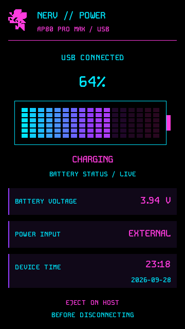

# NERV · AP80 Pro Max

**A cyan, pink and purple Rockbox theme for the Hidizs AP80 Pro Max.**

Built for the **360 × 640 portrait touchscreen**: large cover art, live stereo LED meters, tiny touch transport controls, a playback footer in every menu, and a dedicated USB power dashboard.

[**Download theme 2.0.0**](https://github.com/mr-f0xx/NERV-AP80-Pro-Max/releases/tag/theme-v2.0.0) · [Installation](#installation) · [Controls](#controls) · [Compatibility](#compatibility)

## Preview

<table>
  <tr>
    <th>Now Playing</th>
    <th>Main menu</th>
    <th>Charging screen</th>
  </tr>
  <tr>
    <td></td>
    <td></td>
    <td></td>
  </tr>
</table>

Each screenshot is shown at the device's exact **360 × 640** format (9:16, 1:1 pixels). They are unretouched **Rockbox AP80 Pro Max simulator captures** — no mockups, stretching or painted-over UI. On narrower windows, scroll the row sideways to see all three.

### Now Playing

- **320 × 320 cover art**, with title, artist, album, year and file information beside live **stereo LED meters** (cyan → purple → pink peak meters, not a frequency spectrum).
- **Tap or drag the progress bar to seek.**
- Tiny tactile **previous · play/pause · next** buttons centred at the bottom. The centre icon shows pause while playing and play when paused or stopped.
- Elapsed / total time on the left; playlist position — and the next track near the end of a song — on the right.
- Header with volume bar, shuffle/repeat indicators and an outlined pink **segmented battery icon** with a charging bolt.

<sub>Preview track: **“Pluto Moon” by Afta-1**, from *Aftathoughts Vol.1* (2008) — [listen on YouTube](https://www.youtube.com/watch?v=np_ZN1gbPqw). Artwork and metadata identify the song; the audio driving the meters is a generated test tone, and codec, bitrate, battery and clock values come from the simulator.</sub>

### Main menu

- Pink **NERV** logo, menu title, model label and battery level in the header.
- Large, icon-led menu and file-browser lists.
- **Playback footer on every menu screen:** a tactile pink play/pause button, the current track on a cyan bar, and the **next track** (artist – title) on a pink bar.

### Charging screen

- Shown while the player is connected over USB.
- Battery percentage, segmented battery gauge and `CHARGING` / `BATTERY FULL` / `EXTERNAL POWER` status.
- Battery voltage, power input, device time and date, plus a safe-eject reminder.

## Installation

This is a **theme-only package**. Rockbox must already be installed; the download does not include firmware or a bootloader.

1. Download **`NERV-AP80-Pro-Max-theme-v2.0.0.zip`** from the [theme release](https://github.com/mr-f0xx/NERV-AP80-Pro-Max/releases/tag/theme-v2.0.0).
2. Extract it to the root of your player's storage, **merging** its `.rockbox` folder with the existing one. Do not delete or replace your entire Rockbox installation.
3. Eject the player safely.
4. Open **Settings → Theme Settings → Browse Theme Files** and select **`NERV_AP80.cfg`**. Menu wording may vary by build.
5. For touch controls, select **Point** under **Settings → General Settings → Display → Touchscreen Settings**.

**Updating?** Merge the new package over your existing installation and reselect `NERV_AP80.cfg`. `Playback_Icons.bmp` from older versions is no longer used and can be deleted.

To install from this repository instead, copy the contents of its `.rockbox/` folder to the matching folder on the player.

## Controls

| Area | Action |
|---|---|
| Progress bar | Tap to seek; drag and release to choose a position |
| ⏮ · ▶/⏸ · ⏭ (Now Playing, bottom centre) | Previous track · pause/resume · next track |
| ▶/⏸ (menu footer) | Pause/resume; when stopped, resumes the last playlist |
| Stereo LED meters, up-next bar, USB dashboard | Display only |

Touch targets do not overlap each other or the time readout, and are disabled while the theme's Hold view is shown. Rockbox's own lock and Party Mode restrictions still apply. The theme does not change your touchscreen-mode setting.

## Compatibility

- Designed specifically for the **Hidizs AP80 Pro Max, 360 × 640** — not the older AP80 / AP80 Pro / AP80 Pro-X layout.
- Checked with the target-specific Rockbox skin parser and the AP80 Pro Max simulator (Rockbox source `e9a6b588`). **Physical-device verification is still needed**, especially with third-party firmware builds.
- The LED meters need native `%pL` / `%pR` peak-meter support and add some redraw work, which may affect battery life.
- The menu footer shows track and up-next details once Now Playing has been opened since boot (a Rockbox limitation). The up-next bar is hidden when stopped and on the last track.
- The USB dashboard replaces the skin-controlled USB page, **not** a bootloader/offline charging screen. `CHARGING` appears only when Rockbox reports active charging; unknown battery/voltage readings stay unknown, and no charge-time estimate is invented.

If fonts or graphics are missing, check that the folder structure was preserved and reload the theme. For rendering or touch problems, open an [issue](https://github.com/mr-f0xx/NERV-AP80-Pro-Max/issues) with your firmware version and a photo or screenshot.

## Repository

```text
.rockbox/      Installable theme: WPS/SBS skins, bitmaps, fonts, icons, .cfg
screenshots/   Native 360 × 640 simulator captures
LICENSES/      Upstream theme notice and font licences
CREDITS.md     Full attribution
```

## Credits & licensing

Adapted from **NERV by EppsNL**, originally for the Innioasis Y1. The upstream theme declares **CC-BY-SA**; the original notice is preserved without inventing a licence version. The bundled fonts use the **SIL Open Font License**.

Thanks to EppsNL, the original Snarty/SPAZZ/SNAZZ theme authors, the Kode Mono and MPLUS font projects, and the Rockbox contributors. Full attribution and licence details: [CREDITS.md](CREDITS.md).
